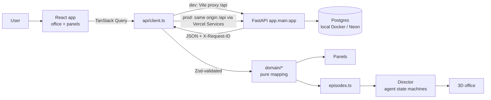

# AI CEO HQ — Frontend Plan ("the face")

**Version:** v1, **APPROVED** by the owner 2026-09-28, with every recommendation and open item O-1…O-7 as
recommended
**Date:** 2026-09-28
**Baseline:** local `main` at `733b19b` (M0–M9 closed; VS-01 complete)
**Status:** the high-level description and rationale for the frontend track. **The normative text is
`CONTEXT/FRONTEND_SPECIFICATION.md`, which governs wherever this plan is coarser or differs.** Five statements here
were corrected before F0 (specification §17). This plan is frozen after the F0 commit.

This document plans a visual, interactive frontend for the AI CEO system. A 3D office drawn in a pixel-art style
is the home screen. Small agents stand for the real VS-01 components and deliver their work to a CEO desk. There,
the owner reads ranked briefs and records decisions.

It follows the order the owner asked for: explore, research, question, plan, document. Section 1 records every
decision the owner made during the questioning round. The rest of the plan is built on them.

---

## Contents

0. [Summary](#0-summary)
1. [Decisions locked in the questioning round](#1-decisions-locked-in-the-questioning-round)
2. [What exists today: the facts the UI must respect](#2-what-exists-today-the-facts-the-ui-must-respect)
3. [Research: what is already built, and what we reuse](#3-research-what-is-already-built-and-what-we-reuse)
4. [What we build: the product](#4-what-we-build-the-product)
5. [Why we build it this way](#5-why-we-build-it-this-way)
6. [Architecture: how it is implemented](#6-architecture-how-it-is-implemented)
7. [Every panel mapped to a real API route](#7-every-panel-mapped-to-a-real-api-route)
8. [Deployment: local and Vercel](#8-deployment-local-and-vercel)
9. [Step-by-step phases F0–F7](#9-step-by-step-phases-f0f7)
10. [Governance and gates](#10-governance-and-gates)
11. [Acceptance criteria](#11-acceptance-criteria)
12. [Risks and mitigations](#12-risks-and-mitigations)
13. [Ideas added beyond the brief](#13-ideas-added-beyond-the-brief)
14. [Deliberately not proposed](#14-deliberately-not-proposed)
15. [Open items for the owner's review](#15-open-items-for-the-owners-review)
16. [Sources](#16-sources)

---

## 0. Summary

- **What.** A React + TypeScript app in a new `frontend/` folder of this repository.
  - Its home screen is a real 3D office rendered in pixel-art style, following the reference image: a 3/4
    top-down view, warm wooden floor, chunky bright agents, `SNAKE_CASE` name tags and glowing cyan hand-off
    arrows.
  - Each agent is a real VS-01 component. Clicking one opens a panel with that component's real output from the
    existing API.
  - The CEO desk holds every WATCH-or-above brief in the system's own ranking order. There the owner approves or
    rejects a brief, and the decision chain updates.
- **Why.** The owner wanted three things:
  - a normal user should never need Swagger or cURL;
  - a reviewer can be walked through the whole system in 3–5 minutes;
  - the frontend should be built to industry standard.

  The office also shows the architecture itself, stage by stage, as people at desks handing work to each other.
- **How.**
  - Stack: React 19, Vite, TypeScript, React Three Fiber, drei, three's pixel render pass, Tailwind and
    shadcn/ui, TanStack Query, Zustand and Zod.
  - Zero backend code changes: every panel is served by a route that exists today (section 7).
  - Hosting: Vercel Services puts the frontend and FastAPI on one domain, backed by Neon Postgres. The demo
    database is writable and resettable.
- **Phases.** F0 spec → F1 foundation → F2 Classic view (data before pixels) → F3 static office → F4 life and
  choreography → F5 hosting → F6 polish → F7 industry-readiness (needs backend milestones).
  - Each phase follows the M-milestone discipline, with gates sized for UI work.
- **Growth.** Unbuilt departments (VS-02 onward) are locked, labelled rooms. When a slice lands, its agent joins
  through a "NEW HIRE!" ceremony, as in the reference image.

---

## 1. Decisions locked in the questioning round

| ID | Question | Owner's decision | Consequence for the build |
|---|---|---|---|
| D-F-1 | What does an agent's "busy" animation reflect? | **Ambient life, real output** | Agents idle, stroll and sip coffee all the time. A *working* pose plays only while a real request is in flight, or during a **labelled** replay of a recorded result. Every number or word in a panel comes from the API. |
| D-F-2 | Numeric score (the pasted "78 / 100") or bands? | **Band only** | A four-step ordinal meter: NONE, WATCH, ELEVATED, CRITICAL. It is always shown with the rules and signals that produced it. The UI never shows a score or a percentage, consistent with the recorded rejection of a blended score. |
| D-F-3 | What goes on the CEO desk? | **All briefs, ranked** | Every WATCH-or-above brief, in the order the API returns. Executive-worthy briefs are pinned first with a badge. They are called *briefs*, never "tickets", so they don't clash with support tickets. |
| D-F-4 | How are future slices shown? | **Locked rooms, labelled** | The full office layout is built now. Unbuilt departments are dimmed rooms with an "Opens with VS-0x" sign. |
| D-F-5 | 2D pixel art, 3D, or pixel-rendered 3D? | **3D, pixel-art rendered** | A real 3D scene drawn through three.js's pixel pass with outline edges. Text overlays stay crisp. A switch turns pixelation off for a smooth-toon look. |
| D-F-6 | World versus "serious" screens | **World home + panels** | Clicking in the office opens real data panels. A *Classic view* shows the same data as plain pages: the fallback if WebGL fails on the review laptop, and an accessibility path. |
| D-F-7 | What can the CEO decide? | **Whole-brief approve/reject** | Recommended actions are shown as a readable list with their evidence. There is one Approve/Reject with a note, and a later decision can supersede it. This matches `POST /risk/briefs/{id}/decision` exactly. |
| D-F-8 | Writes on the hosted site | **Writable, resettable demo DB** | Approve/Reject and "Run assessment" work on the hosted site against a disposable database. A documented reset re-seeds it before each review. |
| D-F-9 | Deadline | **No fixed date** | The plan moves by quality gates, not by calendar. |
| D-F-10 | Process | **Same discipline, gates sized for UI** | Each phase gets a spec, acceptance criteria and one commit. Gates are typecheck, lint, Vitest, Playwright and screenshot checks. There are no mutation audits for UI code. No push happens without approval. |
| D-F-11 | Backend changes in F0–F6 | **Zero backend code** | Only repository-level deploy configuration is added. Anything else becomes a separate, approved backend milestone. |
| D-F-12 | Agent look | **The reference image** (pixel office) | Chunky, bright agents with role silhouettes, name tags, "?" bubbles, glow on active agents and neon hand-off arrows. |

---

## 2. What exists today: the facts the UI must respect

### 2.1 API surface (all under `/api/v1`)

| Area | Routes | UI use |
|---|---|---|
| Health | `GET /health` | HUD status light; the MEMORY robot's mood |
| Sources | `GET /sources`, `GET /sources/{source}/health` | Connector agents: who works at the Data Dock, and whether each source is reachable |
| Ingestion | `POST /ingestion/runs`, `GET /ingestion/runs`, `GET /ingestion/runs/{run_id}`, `GET /ingestion/runs/{run_id}/errors` | Connector activity, run history and quarantine |
| Entities | `GET /entities/{type}`, `GET /entities/{type}/{id}`. The types are `organizations`, `employees`, `customers`, `deals`, `projects`, `support_tickets` and `documents` | Names, ticket and deal details, document text, record counts |
| Metrics | `GET /metrics/ingestion` | MEMORY robot's stats |
| Risk | `POST /risk/assessments`, `GET /risk/assessments`, `GET /risk/assessments/{id}`, `GET /risk/briefs/{id}`, `POST /risk/briefs/{id}/decision`, `GET /risk/briefs/{id}/decisions` | Everything the analysts and the CEO do |

### 2.2 Facts that shape the design

- **There is no "list briefs" route.** Briefs are reached through `GET /risk/assessments`, whose items carry
  `brief_ids`. The CEO inbox is built from that list; this is feasible and specified in section 7.
- **There is no CORS, no login and no live event stream.** None is needed:
  - Same-origin serving avoids CORS: the Vite proxy locally and Vercel Services when hosted.
  - Login is deferred to F7.
  - Animation honesty comes from real requests and labelled replays, not from events (section 6.5).
- **Every response carries `X-Request-ID`,** and every error envelope repeats it. The UI shows it in error toasts
  and in the "Show the API call" X-ray (section 13).
- **The brief `payload` is typed `dict[str, Any]` in OpenAPI.**
  - Its shape is fixed by `payload_version = 1` and the golden brief `tests/golden/vs01_cust007_brief.txt`.
  - The frontend therefore validates it with hand-written Zod schemas. It fails loudly if `payload_version` is
    not 1.
- **The bands are ordinal:** NONE, WATCH, ELEVATED and CRITICAL. The code states: "Never a percentage, never a
  probability."
- **Ranking** follows the API's list order. The `ranking_key` is (band descending, S8 descending, S4 descending,
  `source_id` ascending), and it never reads money.
- **Decisions are APPROVED or REJECTED on a whole brief.**
  - Each decision binds to `payload_hash` and chains through `supersedes_id`.
  - `decision_status` is PENDING, APPROVED or REJECTED.
  - `actor` is recorded, not authenticated. The UI says so next to the name field.
- **`as_of` must be deliberate.**
  - An explicit date is the acceptance path; the README demo uses `2026-09-18`.
  - `null` resolves to the latest support ticket's date (`MAX_TICKET_CREATED_AT`).
  - The backend never uses `now()`.
- **The data:**
  - 233 rows: 50 customers, 44 deals, 80 tickets, 24 employees, 22 projects, 1 organisation and the documents.
  - One run makes 50 assessments.
  - Briefs exist for WATCH and above.
  - **CUST-007 (Meridian Textiles) alone is CRITICAL and executive-worthy.**
- **The CUST-007 story is the demo's spine:**
  - 5 tickets arrive in a 14-day window, meeting DOC-003's escalation rule of 3.
  - SALES wants `ACCELERATE_DEAL_CLOSE` on DEAL-001 (90%, USD 5,361.44).
  - SUPPORT wants `PAUSE_DEAL_PUSH_UNTIL_TICKETS_RESOLVED`.
  - Policy **CONF-001** resolves the conflict for SUPPORT, and SALES's position is kept as **recorded dissent**.
  - Five recommended actions and three linked documents follow.
- **No language model is involved.** The brief's own limitations say: "no language model, embedding or prompt
  produced any part of this brief."
  - The office must not imply that the agents are LLMs. They are rule-based agents, and the About panel says so.
- **Order of stages inside one assessment run** (`app/decisions/assessment.py`), which the choreography follows:
  1. Resolve the scope and the Layer 1 fingerprint.
  2. Derive document links.
  3. Build the contexts: signals and band.
  4. Take the analyst positions.
  5. Reconcile.
  6. Store the assessment.
  7. For WATCH and above, build the payload, resolve citations, render the brief and store it.

### 2.3 Repository guardrails the frontend must not trip

- `test_g2_security_boundary` scans `app/` and `scripts/` for HTTP-client and subprocess imports. **No new code
  goes in `scripts/`**; the demo reset is a Makefile target composed of existing commands.
- `test_docker_packaging` requires certain `.dockerignore` entries. The check is a superset, so adding
  `frontend/node_modules` is safe, but it is a Docker change and needs approval. The Dockerfile copies named
  folders only, so `frontend/` never reaches the API image.
- `scripts/secret_scan.py` flags any identifier containing `token`, `secret`, `password`, `api_key` or
  `access_key` that is assigned a quoted string of 8 or more characters, even inside comments. Frontend code will
  be scanned once it is tracked, so naming discipline applies to TypeScript too.
- `test_i2_readme` pins README test counts. Frontend README text goes in a new section that leaves counted lines
  untouched.

---

## 3. Research: what is already built, and what we reuse

### 3.1 The two repositories the owner shared

| | **agent-office** (AgentSystemLabs) | **Claw3D** (iamlukethedev) |
|---|---|---|
| Licence | MIT | MIT |
| Activity | 111★, pushed 2026-09-27 | 2,260★, 621 forks, pushed 2026-08-21 |
| Stack | three.js 0.186 (vanilla, not React) in React 18 panels, Vite 8, Node 20 server with node-pty and WebSockets | Next.js 16, React 19.2, three 0.183, **@react-three/fiber ^9.5, @react-three/drei ^10.7**, Phaser 3.90 builder, Tailwind 4, Vitest and Playwright |
| Characters | **Procedural toon "Person"**: sphere head with blush and smile, capsule body, `MeshToonMaterial`, poses stand/walk/sit/type, reach and pop easing curves, look picked from a seed hash | Procedural box-primitive agents with arm and leg swing, a status dot, a pulse ring, nameplates and speech bubbles |
| Status language | Antenna bulb (working, needs input, done), an overhead card naming the current action, confetti on completion | Status dot, speech bubble clamped to 180 characters, nameplate |
| Office | Procedural rooms, cork boards, weather sky | **CC0 Kenney Furniture Kit GLBs** (`desk.glb`, `chairDesk.glb`, `computerScreen.glb`, `loungeSofa.glb`…), **A\* grid pathfinding** (`src/lib/office/pathfinding.ts`, about 400 lines, with unit tests), navigation routes, camera and lighting system |
| Backend coupling | Heavy: PTYs, terminal mirroring, voice, GitHub | Heavy: OpenClaw gateway, a 7,248-line `RetroOffice3D.tsx` |

**What we take:**

- From **agent-office**, ideas only:
  - the antenna-bulb status;
  - the overhead action card;
  - the pose set and easing curves;
  - confetti on done;
  - seeded looks.

  Its characters are vanilla three.js, so we re-express them as R3F components rather than copy them.
- From **Claw3D:**
  - the A\* pathfinding module and its tests, adapted under MIT with attribution;
  - the nameplate and speech-bubble text clamping;
  - the camera and lighting organisation;
  - the fact that Kenney CC0 furniture works well in this style.

**What we leave:**

- agent-office's PTY, terminal, voice and multiplayer machinery. Its smoking-break animation is unsuitable.
- Claw3D's gateway, its Phaser builder, Next.js and the monolithic scene file.

### 3.2 Other prior art found

| Project | What it is | Take |
|---|---|---|
| **ai-office** (Gaurav2693, MIT) | Isometric React 19 + three.js office with 9 agents, behaviour state machines (desk, walk, water cooler, meetings), canvas-drawn monitor screens, day/night cycle | **Monitors that show live content**: SIGNALS_AGENT's monitor can show CUST-007's real S1–S15. The state-machine shape. |
| **VirtOffice** / black-knights-3d-office | Three.js isometric office fed by server-sent events, polling or webhooks | Confirms an office can be fed by plain HTTP rather than a bespoke gateway |
| **Pixel Agents** (standalone fork), **Claude-Office** | 2D pixel-art offices for Claude Code sessions | Status-bubble vocabulary only. They are 2D, and we chose 3D. |
| **OpenOfficeRL** | React 19 + Vite with a 2D pixel view and a three.js 3D view, FastAPI backend | Confirms React + Vite + FastAPI is a proven pairing for exactly this |

### 3.3 Art, rendering and hosting facts verified

- **Pixel look in real 3D:**
  - three.js ships `RenderPixelatedPass`, which takes a `pixelSize` and normal and depth edge strengths for
    outlines (official example `webgl_postprocessing_pixel`).
  - pmndrs `postprocessing` ships `PixelationEffect`.
- **CC0 assets:**
  - Kenney Furniture Kit, the same models Claw3D ships;
  - KayKit Furniture Bits (50+ low-poly pieces, glTF, CC0);
  - Quaternius animation library (CC0), optional.

  CC0 needs no attribution. We still record the source of each asset for provenance.
- **Vercel:**
  - FastAPI is auto-detected at `app/main.py` with a top-level `app`, which this repo already has.
  - The Python runtime is **3.12 (default), 3.13 or 3.14. There is no 3.11.**
  - The bundle limit is 500 MB. Files can be excluded with `functions.excludeFiles`, and lifespan events are
    supported.
- **Vercel Services (beta):**
  - one project, one domain, several services;
  - `/api/(.*)` can route to FastAPI **with the original path preserved**, so `/api/v1/...` works unchanged;
  - everything else routes to the frontend. The browser only ever sees one origin, so there is no CORS.
- **Neon via the Vercel Marketplace:** the free plan gives 0.5 GB storage, 100 CU-hours a month and scale to
  zero. That is ample for 233 rows.

### 3.4 Licence handling for anything we adapt

- Every file adapted from an MIT project keeps its copyright notice. It is listed in
  `frontend/THIRD_PARTY_NOTICES.md` with the source repository, file path, commit SHA and a one-line description
  of what changed.
- Every CC0 asset is listed in the same file with its pack name and URL.
- A test fails if a file under `frontend/src/vendor/` is missing from that list.

---

## 4. What we build: the product

### 4.1 The office floor plan

A fixed floor plan: the rooms are in the same place every time, so a reviewer can learn it in seconds. The
pipeline flows left to right and top to bottom towards the CEO corner.

```
+--------------------------------------------------------------------------------------+
| DATA DOCK               | EVIDENCE LAB       | SIGNALS DESK       | CEO CORNER OFFICE   |
|  CSV_AGENT              |  LINKER_AGENT      |  SIGNALS_AGENT     |  CEO desk           |
|  ODOO_AGENT  REST_AGENT |  (magnifier)       |  monitor: S1..S15  |  inbox tray  [3]    |
|        |                |                    |                    |  corkboard:         |
|   MEMORY robot          |                    |                    |  decision chain     |
|   (Postgres archive)    |                    |                    |                     |
+-----------------+-------+----------+---------+----------+---------+                     |
| ANALYST BULLPEN |  DEBATE TABLE    |  BRIEF STUDIO      |  BREAK AREA                  |
|  SALES_AGENT    |  RECONCILER_AGENT|  BRIEF_WRITER      |  coffee, plants, sofa        |
|  SUPPORT_AGENT  |  (gavel)         |  (typewriter)      |  (idle destinations)         |
+-----------------+------------------+--------------------+------------------------------+
| [locked] PIPELINE ROOM  | [locked] ACCOUNT 360 | [locked] WAR ROOM | [locked] COPILOT   |
|   opens with VS-02      |   opens with VS-03   |  opens with VS-04 |  opens with VS-05  |
+--------------------------------------------------------------------------------------+
```

### 4.2 The agent roster: each agent is a real component

| Name tag | Real component | Silhouette and prop | *Working* when | Click opens |
|---|---|---|---|---|
| `CSV_AGENT`, `ODOO_AGENT`, `REST_AGENT` | `app/connectors/*` (one agent per source **read from `GET /sources`**, not hard-coded) | Hard hat, crate trolley | A `POST /ingestion/runs` for that source is in flight | Source capabilities, health result, latest runs, record counts, quarantined errors |
| `MEMORY` robot | Layer 1 Postgres (canonical store) | Friendly robot with circuit lines to the desks, as in the reference image | Any request is in flight (a soft blink) | Health, records per entity type, Layer 1 fingerprint, ingestion metrics |
| `LINKER_AGENT` | `app/evidence/linker.py` (M4) | Magnifying glass | Assessment in flight, step 2 | Document links (basis `EXACT_NAME`/`ID_TOKEN`, confidence, span offsets) and cited spans with quoted text |
| `SIGNALS_AGENT` | `app/intelligence/signals.py` and `bands.py` (M3) | Abacus; **its monitor shows real signals** | Assessment in flight, step 3 | S1–S15, satisfied rules, band, derivations with their rule text and ticket ids |
| `SALES_AGENT` | `app/analysts/commercial.py` (Function `SALES`) | Suit, rising-chart clipboard | Step 4 | SALES positions: stance, action, object, rationale, evidence |
| `SUPPORT_AGENT` | `app/analysts/support_risk.py` (Function `SUPPORT`) | Headset | Step 4 | SUPPORT positions, same fields |
| `RECONCILER_AGENT` | `app/decisions/reconciler.py`, `policy.py`, `conflicts.py` (M6) | Judge's wig and gavel | Step 5 | Conflicts, the resolution (policy id, version, rationale, evidence), recorded dissent, worthiness |
| `BRIEF_WRITER` | `app/decisions/brief.py`, `payload.py` (M7) | Typewriter | Step 7 | Narrative, payload hash, template and policy versions, citation count |
| CEO desk (you) | `app/decisions/approval.py` (M8), the human approval boundary | An empty executive chair: **the CEO is the human user**, so the desk waits for you | Never animated as "thinking": the CEO decides, the system does not | CEO inbox, then brief detail and decision |

Agent names follow the reference image's `SNAKE_CASE` tags. Every agent has an "About" line naming its module path,
so a technical reviewer can map the world to the code.

### 4.3 Visual language (from the reference image)

- **Name tags:** black rounded pill, white monospace capitals (`SUPPORT_AGENT`), always readable. They are HTML
  overlays, not pixelated.
- **Antenna bulb:**
  - grey for idle;
  - cyan for working;
  - amber for waiting on the CEO;
  - green for done;
  - red for error.

  Each colour always comes with an icon or word; colour is never the only signal.
- **Active glow:** a green outline around the agent currently doing real work, as in the reference image.
- **Bubbles:** "?" when waiting, and an action caption for the current real step, e.g.
  `LINKING DOC-005 → CUST-007` or `BAND: CRITICAL`.
- **Neon hand-off arrows** (the image's cyan arrows), each labelled with the real hand-off and its real value:
  - `233 RECORDS` (connector to MEMORY);
  - `6 LINKS` (linker to signals);
  - `BAND CRITICAL` (signals to analysts);
  - `CONFLICT DEAL-001` (sales and support, drawn in red);
  - `CONF-001 → SUPPORT PREVAILS`;
  - `BRIEF 3f2a…` (writer to CEO).
- **Band colours:**
  - NONE, slate;
  - WATCH, yellow;
  - ELEVATED, orange;
  - CRITICAL, red.

  Each band always comes with its text and a pixel icon.
- **Palette:** a warm wood floor and cream walls, with saturated role colours on the agents and cyan and green
  neon for data flow. The office reads cosy; the data reads electric.
- **Type:** a pixel font for tags and in-world labels, a clean sans for panels and a monospace font for ids and
  hashes. All are Google Fonts under the OFL.

### 4.4 The 3–5 minute demo script

1. **Arrive.** The office is alive: agents type, one fetches coffee, the MEMORY robot hums. The HUD shows health
   (green), dataset `as_of`, a short Layer 1 fingerprint and **Run assessment**.
2. **Click MEMORY.** It holds 233 records across 7 entity types, with the fingerprint shown. "This is Layer 1."
3. **Press Run assessment** (`as_of 2026-09-18`). This is a real `POST /risk/assessments`.
   - While it is in flight, the agents switch to working poses in pipeline order.
   - When it returns, the office **replays the real result step by step**:
     - LINKER's arrow shows 6 links;
     - SIGNALS's monitor fills with S1–S15;
     - SALES and SUPPORT walk to the debate table, and a red `CONFLICT DEAL-001` arrow appears;
     - the RECONCILER's gavel lands, `CONF-001 → SUPPORT PREVAILS`, and a dissent note is pinned;
     - BRIEF_WRITER walks the brief to the CEO tray.
   - If the API answers 200 (everything already existed), the banner says **"Already assessed: replaying recorded
     results"**. It never pretends new work happened.
4. **Click the CEO desk.** The inbox is ranked. CUST-007 is pinned: `CRITICAL · EXECUTIVE`. The two other
   briefs at this date, CUST-025 and CUST-036 (both WATCH), follow in API order, each with its `PENDING` chip.
5. **Open the brief.** It shows:
   - the band meter and the six satisfied rules;
   - the signal grid;
   - evidence tabs for tickets, documents, deals and cited quotes;
   - the conflict and dissent;
   - the five recommended actions;
   - the escalation path as a small org chart;
   - the limitations.
6. **Approve** with a note: "Assign a dedicated owner today." A pixel **APPROVED** stamp lands, confetti falls,
   the chain shows ① with actor, time and the payload hash it binds to, and the corkboard updates.
7. **Optional:** reject later, with the prior decision superseded, to show the append-only chain.
8. **Toggle Classic view.** The same data appears as plain pages. Open **Show the API call** to see the exact route
   and request id behind a panel, and follow the `/docs` link to Swagger for developers.
9. **Point at the locked rooms.** "When VS-02 lands, a new agent is hired here."

### 4.5 Screens and panels

- **HUD (top bar):**
  - product name;
  - health light;
  - `as_of` selector (the explicit date by default);
  - **Run assessment**;
  - Office / Classic toggle;
  - Pixel / Smooth toggle;
  - sound (off by default);
  - "?" tour.
- **Agent panel** (right drawer):
  - avatar and name tag;
  - one line on what the agent does;
  - its module path;
  - **latest real output**, with loading, empty and error states;
  - evidence links;
  - **Show the API call** (route, status, `X-Request-ID`, duration).
- **CEO inbox** (drawer):
  - a ranked list with band chip, executive badge, `decision_status` chip and customer name and id;
  - a filter by band;
  - the `as_of` context.
- **Brief detail** (full overlay). Sections mirror the brief's 11 narrative sections, drawn visually:
  1. identity;
  2. risk state and why (meter, rules, worthiness reason);
  3. signals and derivations;
  4. evidence tabs;
  5. commercial context per currency, with no cross-currency total;
  6. conflict and resolution;
  7. recorded dissent;
  8. policy and contract quotes;
  9. chronic backlog;
  10. recommended actions;
  11. escalation path and limitations.

  A **Narrative** tab shows the stored text exactly, because the narrative is what was rendered and stored.
- **Decision panel:** Approve or Reject, a note (up to 2000 characters, the API limit) and "Your name" (kept only
  in this browser, as a convenience). Beside it sits the fixed line: *"Identity is recorded, not authenticated.
  Nothing is executed."*
- **Decision chain:**
  - a vertical timeline ①, ②, and so on;
  - each entry shows actor, decision, note, `decided_at` and the payload hash, with "supersedes ①" links;
  - the empty state reads **"No decisions recorded for this brief yet."**
- **Classic view routes:** `/classic`, `/classic/briefs`, `/classic/briefs/:id`, `/classic/agents/:agent`.
  - The office supports deep links too, e.g. `/?agent=reconciler` and `/brief/:id`, so a reviewer can bookmark a
    view.

### 4.6 States (every panel has all four)

| State | Office | Panel |
|---|---|---|
| Loading | Agents stay at their desks with a "…" bubble | Skeletons |
| Empty | MEMORY says "No records yet: ingest first"; the CEO tray is empty | A call to action: "Run your first assessment" |
| Error | Lights dim a notch, MEMORY shows a red bulb | The message, the error code and `X-Request-ID`, with a retry button |
| Conflict (409) | — | `PAYLOAD_HASH_CONFLICT` means "this brief changed since you opened it". `DECISION_CONFLICT` means "someone decided meanwhile". Both reload the chain; nothing typed is lost. |

---

## 5. Why we build it this way

- **Office first, pages as fallback.** The owner wants a face that is fun and demonstrable. The office makes the
  architecture legible: stages become desks, and hand-offs become arrows. A reviewer understands "connectors → evidence →
  signals → analysts → conflict → brief → human approval" without a diagram. Classic view protects the demo if
  WebGL or the laptop fails.
- **Real data only (D-F-1, D-F-11).** A mocked world would undercut the project's central claim: deterministic,
  cited and auditable. Every number the office shows is one the backend produced. Fixtures exist only in tests,
  where they are recorded from the real API.
- **Pixel-rendered 3D (D-F-5).** It keeps the owner's reference aesthetic while remaining a genuine 3D world:
  rotatable, zoomable, with depth and lighting.
  - Pixelation lowers the internal render resolution, which *helps* performance on weak laptops.
  - True 2D pixel art would need a hand-drawn sprite for every agent and pose, which is the slowest and riskiest
    item for this project.
- **React + Vite, not Next.js.** No server rendering is needed. The app is a single-page client of an existing
  API, and Vite builds faster and simpler. Vercel Services handles routing, so Next.js adds nothing here.
- **R3F over vanilla three.js.** Panels, HUD and world share one React state model. It is also the stack Claw3D
  proves at scale, with the largest ecosystem: drei, postprocessing and the pmndrs tools.
- **Zero backend changes.** Nine milestones built a frozen, heavily gated backend. The frontend is a pure client, so
  its risk is isolated: a UI bug cannot corrupt an assessment.

---

## 6. Architecture: how it is implemented

### 6.1 Stack

These are the current major versions to pin at F1 install time. Claw3D confirms these majors as of August 2026.

| Concern | Choice |
|---|---|
| Language and build | TypeScript (strict), Vite |
| UI | React 19, React Router (URL-driven panels and deep links) |
| 3D | three, @react-three/fiber 9, @react-three/drei 10, @react-three/postprocessing, or three's `RenderPixelatedPass` wrapped as an effect |
| Server state | TanStack Query v5 (caching, retries, invalidation after a decision) |
| World and UI state | Zustand (selected agent, camera, animation queue, toggles) |
| API types | `openapi-typescript` generated from FastAPI's `/openapi.json`, plus **Zod** schemas for the brief payload, because OpenAPI types it as an untyped `dict[str, Any]` |
| Panels | Tailwind CSS 4, shadcn/ui (Radix primitives), lucide icons |
| Tests | Vitest and Testing Library; MSW with **fixtures recorded from the real API**; Playwright end-to-end against the real FastAPI and a test database; Playwright screenshots |
| Quality | ESLint, Prettier, `tsc --noEmit`, a bundle-size budget |

### 6.2 Folder layout

```
frontend/
├── index.html
├── package.json / vite.config.ts / tsconfig.json
├── THIRD_PARTY_NOTICES.md          MIT-adapted files and CC0 assets, with provenance
├── public/
│   ├── models/                     CC0 glTF furniture (Kenney / KayKit)
│   └── fonts/
├── src/
│   ├── app/                        router, providers, layouts, error boundary
│   ├── api/
│   │   ├── client.ts               fetch wrapper: base URL, X-Request-ID capture, error envelope → typed error
│   │   ├── generated/openapi.d.ts  generated from /openapi.json
│   │   ├── schemas/                Zod: brief payload v1, reconciliation, document evidence …
│   │   └── risk.ts  entities.ts  sources.ts  ingestion.ts  health.ts  metrics.ts
│   ├── domain/                     PURE TypeScript, no React, no three
│   │   ├── bands.ts                ordinal band helpers
│   │   ├── inbox.ts                assessments + briefs + customers → ranked inbox (API order kept)
│   │   ├── briefView.ts            payload v1 → view model for every brief section
│   │   ├── spans.ts                cited-span text from document offsets (title + "\n" + body)
│   │   ├── decisionChain.ts        head, supersede target, status
│   │   ├── roster.ts               sources + fixed VS-01 stages → agent roster; locked rooms
│   │   └── episodes.ts             API results → ordered, data-backed animation steps
│   ├── world/
│   │   ├── Office.tsx              scene root (lazy-loaded chunk)
│   │   ├── camera/  lighting/  pixel/   (orthographic 3/4 camera, toon lights, pixel pass)
│   │   ├── rooms/  furniture/      floor plan, walls, locked-room signage
│   │   ├── agents/                 AgentBody, role props, NameTag, AntennaBulb, Bubble, Glow
│   │   ├── flows/                  NeonArrow with a label
│   │   ├── nav/                    walk grid + A* (adapted from Claw3D, MIT)
│   │   └── director/               per-agent state machines driven by episodes
│   ├── panels/                     AgentPanel, CeoInbox, BriefDetail, EvidenceTabs, DecisionPanel, DecisionChain, ApiXray
│   ├── classic/                    the same panels as plain routed pages
│   ├── ui/                         shadcn components
│   └── styles/                     design tokens (colours, band palette, spacing, fonts)
└── tests/
    ├── unit/  component/  e2e/
    └── fixtures/                   recorded from the real API; never imported by src/
```

### 6.3 Data flow



### 6.4 Rendering pipeline

- **Camera:** orthographic, 3/4 top-down (about 35° elevation), matching the reference image.
  - Rotation snaps in 90° steps and camera moves are pixel-snapped, so the pixel grid never shimmers.
  - There are three zoom levels, plus double-click to focus a room.
- **Materials:** `MeshToonMaterial` with a 3-step gradient, flat saturated colours and soft hemisphere and key
  lights.
- **Pixel pass:**
  - The scene renders at 1/3–1/4 resolution with normal and depth edge outlines, then upscales with
    nearest-neighbour sampling.
  - Pixel size adapts to device pixel ratio and the zoom level.
  - The Smooth toggle bypasses the pass.
- **Overlays:** name tags, bubbles and arrow labels use drei `<Html>`. They stay crisp and selectable, and screen
  readers can reach them.
- **Characters:** procedural, chunky "chibi-pixel" bodies about 2.5 heads tall. Each role reads by silhouette, as
  in the reference: suit and clipboard, headset, gavel and wig, hard hat, the robot.
  - They are built in code from primitives (agent-office's approach, re-expressed in R3F), so each is a few KB
    rather than a model file.
  - Poses are stand, walk, sit, type, present and cheer.
- **Performance budget:**
  - 60 fps on an integrated-GPU laptop at 1080p;
  - at most about 150 draw calls, with furniture instanced;
  - 3D assets at most 5 MB in total.
  - The world is a **lazy chunk**: Classic view never downloads three.js.
  - If WebGL fails, the app switches to Classic view automatically, with a notice.
- **Motion:** `prefers-reduced-motion` turns walking into instant moves and disables confetti and pulsing.

### 6.5 The Director: how the animation stays honest (D-F-1)

Each agent runs a small state machine:

```
IDLE ──(tracked request starts)──▶ WORKING ──(step result)──▶ HANDOFF ──▶ DONE / WAITING / ERROR ──▶ IDLE
  ▲                                                                                                 │
  └──────────────── ambient loop: wander to coffee / plant / sofa, sit, idle-type ◀──────────────────┘
```

- **Ambient life** is decoration and is visibly distinct:
  - no glow and a grey bulb;
  - it is deterministic, from a seed per agent name, so demos and screenshots are reproducible;
  - `?still=1` freezes it for tests.
- **Live mode:**
  - While a real mutation is in flight (`POST /risk/assessments` or `POST /ingestion/runs`), the stages enter
    WORKING in the code's stage order (section 2.2).
  - Their caption is generic, e.g. `ASSESSING…`, because no intermediate result exists yet.
- **Replay mode:**
  - When the response arrives, or when the user replays any stored assessment, `episodes.ts` builds an ordered
    list of steps **only from returned data**:
    - a conflict step exists only if `reconciliation.conflicts` is non-empty;
    - a brief delivery exists only if `brief_id` is non-null.
  - Every caption and arrow label is a field value.
  - The banner reads *"Replay of recorded results · as_of 2026-09-18"*.
- **Unit-test contract:** for every recorded fixture, each step in the episode cites the JSON path it came from.
  An episode built from a no-conflict assessment contains no conflict step.

### 6.6 Configuration

- `VITE_API_BASE_URL` defaults to an empty string (same origin).
- Development uses a Vite proxy from `/api` to `http://127.0.0.1:8010`, the isolated API of specification R-F-1.
  Production uses the same origin via
  Vercel Services. **CORS is never enabled on the backend.**
- The name remembered for the decision form lives in `localStorage`, wrapped in try/catch, as a convenience only.
  It is never an identity claim.

---

## 7. Every panel mapped to a real API route

This is the evidence for D-F-11's "zero backend code". It was checked against `app/api/v1/*.py` and
`app/api/v1/schemas.py` at `733b19b`.

| UI element | Route(s) | Fields used |
|---|---|---|
| HUD health light | `GET /api/v1/health` | `status`, `version`, `checks.database` |
| Connector agents (who exists) | `GET /api/v1/sources` | `source`, `source_type`, capabilities |
| Connector bulb | `GET /api/v1/sources/{source}/health` | outcome, latency |
| Connector panel | `GET /api/v1/ingestion/runs`, `GET …/runs/{run_id}`, `GET …/runs/{run_id}/errors` | run status, per-entity counts, error summary |
| MEMORY panel | `GET /api/v1/entities/{type}?limit=1` (×7), `GET /api/v1/metrics/ingestion` | `total` per entity type; ingestion counters |
| Layer 1 fingerprint | `GET /api/v1/risk/briefs/{id}`, or the assessment list item | `payload.scope.layer1_fingerprint` (the payload's `scope` has exactly three keys; entity counts come from the entities' `total`) |
| Run assessment | `POST /api/v1/risk/assessments` `{as_of, source_system, customer_source_id?}` | `items[].assessment_id / created / brief_id / payload_hash`; 201 vs 200 |
| CEO inbox | `GET /api/v1/risk/assessments?as_of=…&limit=500` | `band`, `executive_worthy`, `ranking_key`, `brief_ids`, `customer_source_id` (API order kept) |
| Inbox names | `GET /api/v1/entities/customers?limit=500` (50 rows) | `source_id` → customer name |
| Inbox status chips | `GET /api/v1/risk/briefs/{id}` per brief (parallel; N = the number of WATCH-or-above briefs) | `decision_status` |
| SIGNALS, SALES and SUPPORT panels | `GET /api/v1/risk/assessments/{id}` | `signals`, `satisfied_rules`, `positions[]` (`function`, `stance`, `proposed_action`, `object_ref`, `rationale`, `citations`) |
| LINKER, RECONCILER, BRIEF_WRITER panels; brief detail | `GET /api/v1/risk/briefs/{id}` | `payload` (`document_evidence`, `cited_spans`, `reconciliation.{conflicts,resolutions,dissent,worthiness,ranking_key}`, `support_evidence.{tickets,escalation_window,ticket_span,backlog_ticket_ids,escalation_path,derivations}`, `commercial_evidence.deals`), `narrative`, `citations`, `payload_hash`, `policy_version`, `template_version` |
| Quoted text for cited spans | `GET /api/v1/entities/documents?limit=500` | body sliced by offsets over "title + newline + body"; tested against the golden quotes |
| Ticket, deal and employee details | `GET /api/v1/entities/{support_tickets\|deals\|employees}?limit=500` | matched by `source_id` (80 / 44 / 24 rows) |
| Approve / Reject | `POST /api/v1/risk/briefs/{id}/decision` | `actor`, `decision`, `note`, `payload_hash`, `supersedes_id` (the current head) |
| Decision chain | `GET /api/v1/risk/briefs/{id}/decisions` | `items[]` from first decision to head |
| Developer link | `/docs`, `/redoc`, `/openapi.json` | — |

**Known costs, accepted for now:**

- The inbox makes N+1 requests: one list plus one brief per item. N is small (the WATCH-or-above count) and the
  requests run in parallel.
- Entity joins happen client-side, which is trivial at 233 rows.
- Both are recorded as candidates for a future **backend** read endpoint (F7), not changed now.

---

## 8. Deployment: local and Vercel

### 8.1 Local (F1 onward)

- The development database is not the clean dataset, so frontend work never uses it (specification R-F-1).
  `make frontend-backend` recreates an isolated `<db>_frontend` database from clean and serves the working-tree
  API on `127.0.0.1:8010`.
- `make frontend-dev` runs Vite, which proxies `/api` to `127.0.0.1:8010`.
- The Makefile targets are listed in specification §4.1.

### 8.2 Hosted: Vercel Services + Neon (F5)

```json
{
  "services": {
    "web": { "root": "frontend/" },
    "api": { "root": "./", "entrypoint": "app.main:app" }
  },
  "rewrites": [
    { "source": "/api/(.*)",     "destination": { "service": "api" } },
    { "source": "/docs",         "destination": { "service": "api" } },
    { "source": "/redoc",        "destination": { "service": "api" } },
    { "source": "/openapi.json", "destination": { "service": "api" } },
    { "source": "/(.*)",         "destination": { "service": "web" } }
  ]
}
```

This is illustrative only; the exact keys are verified against the Services config reference at F5.

- **Python version:** Vercel runs 3.12–3.14, while the backend is developed on 3.11.
  - F5's first gate runs the **full backend suite in a fresh 3.12 venv** and records the result.
  - If it is not clean, the fallback is a Vercel `container` service built from the existing Dockerfile
    (Python 3.11), or the API hosted elsewhere from the same Dockerfile with `/api` rewritten to it.
- **Bundle:** exclude `tests/**`, `data/fixtures/**`, `data/quarantine/**`, `CONTEXT/**` and `frontend/**` from
  the Python function. Keep `app/`, `config/`, `data/demo/` (the CSV connector reads it) and `migrations/`.
- **Database:**
  1. Provision Neon through the Vercel Marketplace (free plan) and set `DATABASE_URL` to the pooled connection
     string with `sslmode=require`.
  2. Run `alembic upgrade head` and the existing ingestion from the owner's machine, against Neon.
  3. Run one `POST /risk/assessments`.
- **Demo reset (D-F-8):** a Makefile target `demo-reset`.
  - It composes existing commands only: migrate down and up, ingest the demo CSVs, then assess at
    `as_of 2026-09-18`.
  - It targets the hosted `DATABASE_URL`, with an explicit confirmation prompt.
  - No new Python script is involved, because of the G2 boundary. It must be proven twice at F5.
- **Mock sources:** the Odoo and REST mock containers don't exist on Vercel. Their agents show the **real** health
  result, "unreachable", with the caption "mock source runs in local mode only". Nothing is hidden or faked.
- **Abuse limits** (the data is synthetic; there is no authentication until F7):
  - a Vercel Firewall rate-limit rule on `POST /api/*` (check plan availability at F5);
  - a reset before every review;
  - Deployment Protection, if the plan offers it.
- **Fallback if Services (beta) is unavailable:** two Vercel projects, with the frontend's `vercel.json` rewriting
  `/api/:path*` to the API project's URL. The browser still sees one origin.

---

## 9. Step-by-step phases F0–F7

Each phase is spec'd before it starts, gated, committed once with the prefix `F<n>: <summary>`, never pushed
without approval, and closed with its evidence. The allowed paths are listed per phase; touching anything else
means stop and ask.

### F0 — Specification (docs only)
- Turn this plan into the frontend specification: decision ids D-F-*, acceptance criteria AC-F-*, allowed paths
  per phase and the per-phase gate list.
- Owner approves, then commit `F0: finalize frontend specification`.
- **Allowed:** `CONTEXT/` only.

### F1 — Foundation
1. Scaffold `frontend/`: Vite, React, TypeScript strict, ESLint, Prettier, Vitest, Playwright, Tailwind and
   shadcn/ui.
2. Build `api/client.ts`, which captures `X-Request-ID` and maps the error envelope to typed errors. Generate
   OpenAPI types.
3. Write Zod schemas for brief payload v1. Record fixtures from the **real** local API: CUST-007 brief,
   assessment, list, sources, health. Add a contract test that parses them.
4. Add TanStack Query, the router, design tokens (colours, band palette, fonts), the HUD, the Classic-view shell
   and the four states from section 4.6.
5. Add the Vite proxy and the Makefile `frontend-*` targets.

- **Gate:** typecheck, lint, unit, contract and a Playwright smoke test (HUD shows health from the real API). The
  diff under `app/ migrations/ config/ tests/` is empty.
- **Allowed:** `frontend/**`, `Makefile` (new targets), `.gitignore` (`frontend/node_modules`, `frontend/dist`).

### F2 — Classic view complete (data before pixels)
1. Build the `domain/*` pure modules: inbox, briefView, spans, decisionChain, roster, bands. Coverage is 100%.
2. Build the panels: CEO inbox, brief detail (all sections and the Narrative tab), evidence tabs, decision panel,
   decision chain and the eight agent panels.
3. Build the Classic routes and deep links, and the **Show the API call** X-ray.

- **Gate:** an end-to-end test against a real FastAPI and a fresh test database: ingest, assess at `2026-09-18`,
  see CUST-007 pinned, approve, and see the chain and status update.
  - Also: the 409 paths (a stale `payload_hash` and a stale head), the empty chain, and API-down states.
- **Allowed:** `frontend/**`.

### F3 — The office (static)
1. Build the floor plan, walls, rooms and locked-room signage; lay out the CC0 furniture; set up
   `THIRD_PARTY_NOTICES.md`.
2. Add the camera (ortho 3/4, 90° snaps, zoom), toon lighting, the pixel pass and the Smooth toggle.
3. Place the procedural agents at their desks with name tags, bulbs, glow and click targets. Panels open as
   drawers, reusing F2.
4. Add the SIGNALS monitor texture showing real signals, the WebGL-failure fallback and a keyboard **staff
   directory**.

- **Gate:** measured fps budget on the reference laptop; lazy chunk (Classic never loads three); screenshot
  baselines at `?still=1`; accessibility check on panels.
- **Allowed:** `frontend/**`.

### F4 — Life and choreography
1. Adapt the walk grid and A\* from Claw3D (MIT, with attribution and its tests).
2. Build the ambient idle state machines, seeded.
3. Build `episodes.ts` and the Director: live mode during requests, then replay from data.
4. Build the scenes:
   - assessment pipeline;
   - conflict at the debate table;
   - brief delivery;
   - approval stamp and confetti;
   - ingestion at the Data Dock.
5. Add reduced-motion and an optional sound toggle, off by default.

- **Gate:**
  - episode unit tests (no step without a data path; no conflict step without conflicts);
  - an end-to-end test (Run assessment, then the brief appears in the tray, then approve from the world);
  - fps budget with every agent moving.
- **Allowed:** `frontend/**`.

### F5 — Hosting
1. Run the full backend suite on a fresh Python 3.12 venv and record the result. Choose the 3.12 or container path
   (open item O-5).
2. Add `vercel.json` (Services, rewrites, `excludeFiles`; no repository-level Python pin, specification R-F-8),
   `.dockerignore += frontend/node_modules` (Docker change: approval required), and Neon.
3. Migrate and seed Neon, then prove `demo-reset` twice. Add the firewall rate-limit rule.
4. Write a README section, "Frontend and demo", with the demo script. It must not touch the counted lines.

- **Gate:**
  - a Playwright smoke test against the preview URL (health, inbox, open brief, approve, reset, clean again);
  - the backend suite still passes locally;
  - secret scan 0.
- **Allowed:** `frontend/**`, `vercel.json`, `.dockerignore`, `Makefile`, the new README section.

### F6 — Polish and demo readiness
- A three-step onboarding tour, responsive behaviour (phones get Classic automatically), loading art, empty-state
  art and copy review (no LLM claims).
- A performance pass and a full demo rehearsal on the hosted site, timed at 5 minutes or less.

- **Gate:** the whole AC-F list (section 11), with evidence.

### F7 — Industry-readiness (needs approved **backend** milestones first)
- An authentication boundary, so the real CEO identity replaces the free-text actor, and RBAC: a CEO can decide, an
  analyst can view.
- Frontend error reporting tied to `X-Request-ID`, CSP and security headers.
- A backend read endpoint for the inbox, removing N+1.

Each backend item is its own M-style milestone with its own specification.

### After F7: hiring new agents as slices land
When VS-02 (pipeline intelligence, FX) ships:
1. Add its agent to `domain/roster.ts`.
2. Unlock its room.
3. Build its panel on the slice's new routes.
4. Play the **"NEW HIRE!"** ceremony once per browser.

The checklist lives in the frontend README.

---

## 10. Governance and gates

- **Discipline (D-F-10):**
  - a spec before each phase;
  - allowed paths are enforced;
  - one atomic commit per phase (`F<n>: …`);
  - explicit paths are staged, never `git add .`;
  - the owner's identity is the author, with no AI attribution trailers;
  - **no push without explicit approval.**
- **Every phase's gate includes:**
  - `tsc --noEmit` 0;
  - ESLint 0 errors;
  - Vitest green;
  - Playwright green;
  - **backend untouched:** an empty `git diff` for `app/ migrations/ config/ tests/ alembic.ini pyproject.toml`
    unless the phase's spec lists the file;
  - `scripts/secret_scan.py` 0 on the staged tree.
- **Coverage:** 100% lines on `src/domain/**` and `src/api/**`. Panels and world code are covered by component and
  end-to-end tests, not line targets.
- **No mutation audits for UI** (D-F-10). The pure `domain/*` modules are small enough to add one later if the
  owner wants.
- **Rule against fake data:**
  - an ESLint rule forbids `src/**` importing from `tests/**`;
  - a test scans `src/` for hard-coded customer, ticket and deal ids (`CUST-`, `TKT-`, `DEAL-`, `DOC-`) outside
    comments.

---

## 11. Acceptance criteria

| ID | Criterion |
|---|---|
| AC-F-1 | Every value shown in any panel or in-world label traces to an API response. No domain data is hard-coded in `src/` (enforced by the lint rule and the scan test). |
| AC-F-2 | A *working* pose appears only while a tracked request is in flight, or during a replay whose banner says so. |
| AC-F-3 | Risk appears only as the four-level ordinal band with text. No numeric score or percentage appears anywhere. |
| AC-F-4 | The CEO inbox order equals the API's list order, with executive-worthy briefs pinned. This is tested against a recorded response. |
| AC-F-5 | Against a real API and a fresh database: assess at `2026-09-18`, CUST-007 appears pinned `CRITICAL · EXECUTIVE`, approving creates a decision, the chain shows it, and the status reads APPROVED. |
| AC-F-6 | Both 409 cases show a clear explanation and reload the chain without losing the typed note. |
| AC-F-7 | Classic view renders every panel without WebGL, and without downloading the 3D chunk. |
| AC-F-8 | The world holds 60 fps on the reference laptop at 1080p. A WebGL failure falls back to Classic view with a notice. |
| AC-F-9 | The backend is untouched: empty diff under `app/`, `migrations/`, `config/`, `tests/`; the backend suite is green. |
| AC-F-10 | The hosted site is same-origin with no CORS configuration, and `demo-reset` has been proven twice. |
| AC-F-11 | `THIRD_PARTY_NOTICES.md` lists every adapted file and asset with its source and licence. |
| AC-F-12 | `prefers-reduced-motion` is respected, every agent is reachable from the keyboard, and panels meet WCAG AA contrast. |
| AC-F-13 | The secret scan is 0 over all tracked files, including `frontend/`. |
| AC-F-14 | Every panel has loading, empty, error and success states. |
| AC-F-15 | Honesty copy is present. The decision form states that identity is not authenticated and nothing is executed. The About panel states that the agents are rule-based with no language model in VS-01. Replay banners are present. |

---

## 12. Risks and mitigations

| Risk | Likelihood | Mitigation |
|---|---|---|
| WebGL is slow or broken on the review laptop | Medium | Pixelation lowers the render resolution; Classic-view fallback; lazy chunk; measured budget |
| Pixel shimmer while the camera moves | Medium | Orthographic camera, 90° snaps, pixel-snapped moves |
| Vercel has no Python 3.11 | Certain | Full suite on 3.12 first; container or external-host fallback (section 8.2) |
| Vercel Services is in beta | Low–medium | Two-project rewrite fallback, which is generally available |
| The hosted demo is spammed with decisions | Low | Synthetic data, firewall rate limit, reset before reviews; authentication in F7 |
| The payload shape drifts | Low | Zod plus a contract test on recorded fixtures; hard fail when `payload_version` is not 1 |
| Over-claiming "AI" | Medium | Copy review in F6; About panel; AC-F-15 |
| Scope creep into future slices | Medium | Locked rooms (D-F-4); the hiring checklist only after a slice ships |
| MIT attribution is missed | Low | The `THIRD_PARTY_NOTICES` test (section 3.4) |
| A secret-scan false positive on TypeScript names | Medium | Naming discipline; scan the staged tree at every gate |

---

## 13. Ideas added beyond the brief

1. **Show the API call (X-ray).** Every panel can reveal its route, status, duration and `X-Request-ID`. In the
   world, a faint arrow runs from the agent to the MEMORY robot while it fetches. This makes the pasted notes'
   demo story visible on screen: user action → API → domain → database → real response → UI.
2. **Live monitors.** Following ai-office's canvas screens, SIGNALS_AGENT's monitor shows CUST-007's real signals,
   and the CEO's monitor shows the pending count.
3. **Follow the thread.** Clicking `TKT-075` inside a brief highlights SUPPORT_AGENT's desk and the ticket in the
   evidence tray. The brief and the world cross-reference each other.
4. **Time travel.** The `as_of` selector replays any stored assessment date. Assessments are keyed by `as_of`, so
   this is free.
5. **NEW HIRE! ceremony**, taken straight from the reference image, marks slice growth (D-F-4).
6. **Corkboard decision trail.** The decision chain is also pinned as pixel paper notes on the CEO's corkboard.
   APPROVED and REJECTED land as stamps.
7. **Staff directory.** A keyboard and screen-reader list of every agent mirrors the world. It is an accessibility
   path and a fast navigator for reviewers.
8. **Seeded, freezable ambient life** (`?still=1`) for reproducible screenshots and stable tests.

---

## 14. Deliberately not proposed

| Idea | Why not |
|---|---|
| Numeric risk score or gauge | D-F-2 and the recorded strategy decision; the backend defines bands as never a percentage |
| Chatting with agents or LLM reasoning bubbles | VS-01 has no language model. That is the VS-05 copilot slice, behind the `LanguageModel` interface. |
| WebSockets or a live event stream | Needs a backend event API, which is a backend milestone. Real requests plus labelled replays are honest without it. |
| Per-action approval | D-F-7; would need a new backend decision model |
| Multiplayer, voice, terminals (agent-office) | Not what this system does |
| Next.js (Claw3D) or Phaser 2D | Vite SPA is simpler for a pure API client; we chose 3D over 2D (D-F-5) |
| Hosting an open model for "smart" agents | Already rejected in the strategy notes |

---

## 15. Open items for the owner's review

**Resolved 2026-09-28:** the owner accepted every recommendation below. They are recorded as D-F-13…D-F-19 in the
specification.

| # | Item | My recommendation |
|---|---|---|
| O-1 | Product name shown in the HUD | "AI CEO HQ" |
| O-2 | Default `as_of` for Run assessment | Explicit `2026-09-18`, the README demo date and the acceptance path. "Auto (latest ticket)" is an option in the selector. |
| O-3 | Makefile targets, `.gitignore` and README-section edits in F1 and F5 | Approve them as listed in section 9's allowed paths |
| O-4 | `.dockerignore += frontend/node_modules` (Docker change) | Approve at F5 |
| O-5 | Python 3.12 runtime or container fallback on Vercel | 3.12 if the fresh-venv suite is clean, otherwise container |
| O-6 | Pixel font choice | A crisp pixel face for tags only; panels stay in a clean sans |
| O-7 | Sound | Off by default; soft keyboard clicks and a stamp "thunk" when on |

---

## 16. Sources

- agent-office (MIT): https://github.com/AgentSystemLabs/agent-office
- Claw3D (MIT): https://github.com/iamlukethedev/Claw3D
- ai-office (MIT): https://github.com/Gaurav2693/ai-office
- VirtOffice: https://github.com/OneByJorah/VirtOffice
- OpenOfficeRL: https://github.com/bvsbharat/OpenOfficeRL
- Pixel Agents (standalone fork): https://github.com/rolandal/pixel-agents-standalone
- Claude-Office: https://github.com/W17ant/Claude-Office
- three.js pixel post-processing example: https://threejs.org/examples/webgl_postprocessing_pixel.html
  (source: `examples/jsm/postprocessing/RenderPixelatedPass.js`)
- pmndrs postprocessing `PixelationEffect`: https://github.com/pmndrs/postprocessing
- KayKit Furniture Bits (CC0): https://github.com/KayKit-Game-Assets/KayKit-Furniture-Bits-1.0
- Kenney assets (CC0): https://kenney.nl/assets
- Vercel, FastAPI: https://vercel.com/docs/frameworks/backend/fastapi
- Vercel, Python runtime: https://vercel.com/docs/functions/runtimes/python
- Vercel Services: https://vercel.com/docs/services
- Vercel Services routing: https://vercel.com/docs/services/routing
- Neon for Vercel: https://vercel.com/marketplace/neon
- Neon pricing: https://neon.com/pricing
